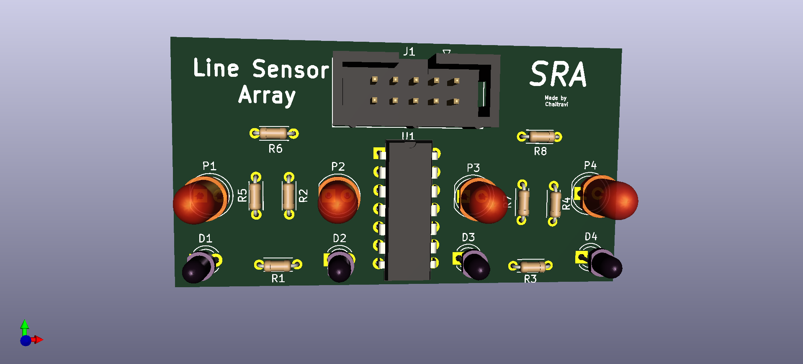
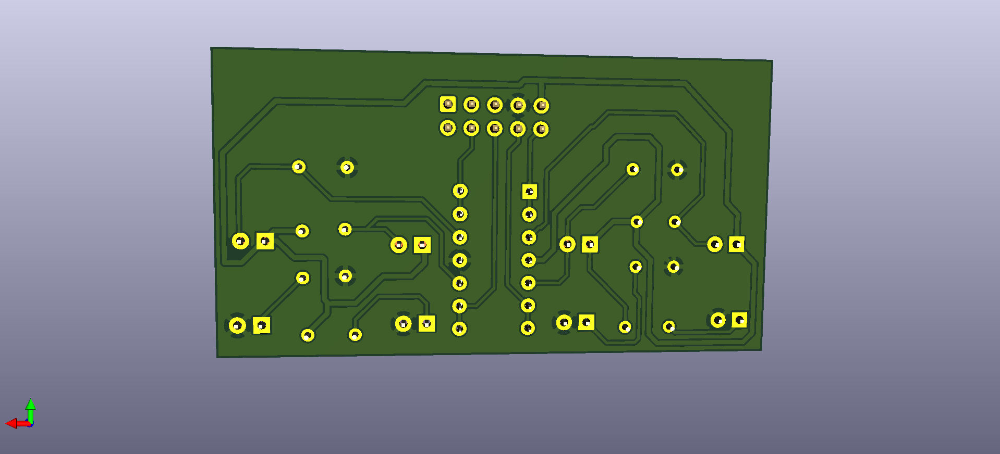

# PCB_Designing-LSA

## A PCB Design for Line Sensor Array(LSA) with 4 sensors

## Software Used

> Designed using kiCAD Software
> To download the software visit : https://kicad.org

## Design

* It is a single layered board. 

* Front View of the Board

* Bottom View of the Board
